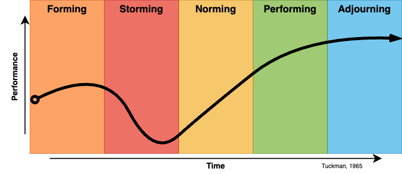

# Facilitation Notes {-}

#### Facilitating Group Learning {-}

#### Facilitation Session {-}

Working in small groups you will facilitate a short 10-15 min learning activity. In your learning pods each select a topic from LDRS 663 and guide your group through a review discussion of that topic. After your learning activity follow-up with a short What, So What, Now What? W3 review of your facilitation sessions to give each other feedback about your facilitation. You will record a video of your session and critically reflect on your actions as the learning facilitator.

Your reflection should be submitted as 1-2-page document.

#### Two Similar, but Different "Teaching Presence" Roles {-}

• Facilitator: Guiding the coordination of a group's collaboration and managing its learning process. The focus of this role is on directly helping the group to improve its functioning in achieving a set outcome.
• Coach: Helping individual learners to take responsibility to grow as individuals and also as a learning community, increase their awareness, and establish their own individual and cooperative goals, norms, and learning processes. The focus of this role is on helping learners to learn how to learn, individually and also as a group.

#### Facilitation Competencies {-}
• Create cooperative working relationships with the group
• Determining group needs and designing group sessions
• Managing group processes
• Selecting appropriate group learning methods and learning processes
• Preparing time and space to support group learning
• Creating and sustaining a supportive and participatory group learning environment
• Demonstrating effective communication
• Insuring inclusiveness
• Managing conflict
• Encouraging creativity
• Guiding group to consensus and desired learning outcome

#### Facilitation Process {-}

##### ACT ONE {-}

* Orient the group
* Set the stage
* Develop themes

##### ACT TWO {-}

* Examine
* Explore
* Problem-solve

##### ACT THREE {-}

* Plan
* Decide
* Conclude

#### Facilitating the Process of Prescribed Learning {-}

$$\text{Current Status}\Longrightarrow \Longrightarrow \Longrightarrow \Longrightarrow \text{Specific Goal}$$ 

#### Facilitating the Process of Inquiry-rich Learning {-}

$$\text{Current Status} \curvearrowright \rightsquigarrow\nearrow\searrow\looparrowright\Updownarrow\rightrightarrows\text{Fuzzy Goal}$$ 

#### Managing Group Dynamics {-}

#### Cohesion Factors that Cultivate (Predictable) Trust {-}

• Similarity. The more similar members are in terms of age, sex, education, skills, attitudes, values, and beliefs, the more likely the group will bond.
• Stability. The longer a group stays together, the more cohesive it becomes.
• Size. Smaller groups tend to have higher cohesion.
• Support. Coaching and encouragement to support other members strengthens the group's identity.
• Satisfaction. How pleased group members are with each other's performance, behaviour, and conformity to group norms increases cohesion.

#### Social Loafing {-}

• There is a tendency of individuals to put in less effort when working in a group context.
• As group size grows, this effect becomes larger.

#### How do learning groups develop over time? {-}

